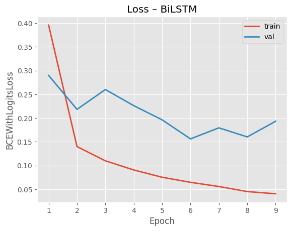
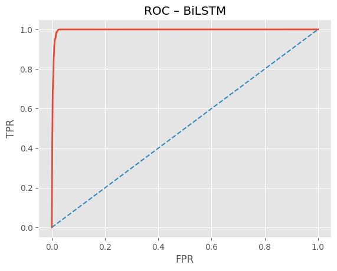
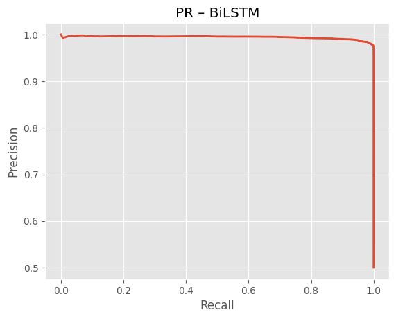
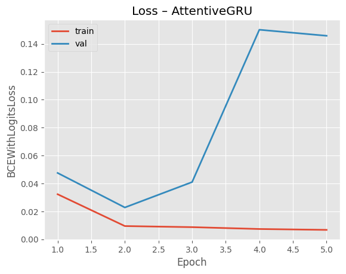
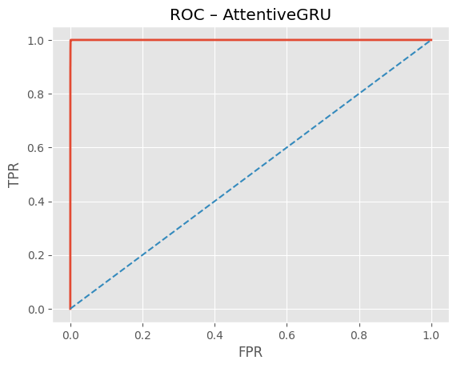
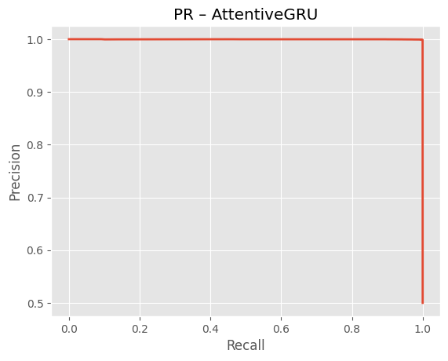
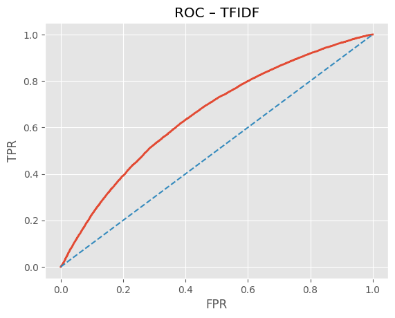
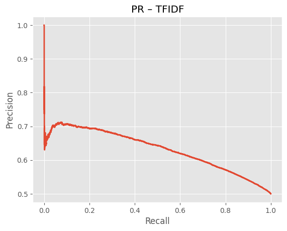

# Short Report — Legal Clause Similarity

## Dataset & Splits

- Train: 105,614 clauses across 395 labels (211,228 pairs)
- Validation: 22,530 clauses across 395 labels (45,060 pairs)
- Test: 22,737 clauses across 395 labels (45,474 pairs)
- Negative/positive ratio per split: 1.0:1


## Architectures & Training

**BiLSTM Siamese**: embedding 128, hidden 128, bidirectional, mean-pool, projection( LN→Linear→ReLU→Dropout ), head 512→256→1, dropout 0.3.  
**Attentive BiGRU Siamese**: embedding 128, GRU hidden 128 bi, single-vector additive attention with masked softmax, head 512→256→1, dropout 0.3.  
**Optimization**: Adam(lr=0.001, weight_decay=0.0001), BCEWithLogitsLoss, grad-clip=2.0, early-stopping patience=3, batch=64, epochs=50.  
**Vocab/seq**: vocab=30000, max_len=150, token pattern `[A-Za-z']+`.


## Performance Summary (Test)

              accuracy  precision    recall        f1   roc_auc    pr_auc  train_time_sec      loss
model                                                                                              
AttentiveGRU  0.993865   0.987878  1.000000  0.993902  0.999893  0.999817     4986.730818  0.023373
BiLSTM        0.960109   0.926113  1.000000  0.961639  0.996446  0.994402     2340.988493  0.157674
TFIDF         0.615824   0.607468  0.654704  0.630202  0.656313  0.630872       79.630193       NaN


## Model-wise Results & Curves

### BiLSTM




**Test metrics**
- Accuracy: 0.9601 | Precision: 0.9261 | Recall: 1.0000 | F1: 0.9616 | ROC-AUC: 0.9964 | PR-AUC: 0.9944

**Confusion matrix (rows=true, cols=pred)**
```
[[20923  1814]
 [    0 22737]]
```

**Classification report**
```
precision    recall  f1-score   support

         0.0     1.0000    0.9202    0.9585     22737
         1.0     0.9261    1.0000    0.9616     22737

    accuracy                         0.9601     45474
   macro avg     0.9631    0.9601    0.9600     45474
weighted avg     0.9631    0.9601    0.9600     45474
```


### AttentiveGRU




**Test metrics**
- Accuracy: 0.9939 | Precision: 0.9879 | Recall: 1.0000 | F1: 0.9939 | ROC-AUC: 0.9999 | PR-AUC: 0.9998

**Confusion matrix (rows=true, cols=pred)**
```
[[22458   279]
 [    0 22737]]
```

**Classification report**
```
precision    recall  f1-score   support

         0.0     1.0000    0.9877    0.9938     22737
         1.0     0.9879    1.0000    0.9939     22737

    accuracy                         0.9939     45474
   macro avg     0.9939    0.9939    0.9939     45474
weighted avg     0.9939    0.9939    0.9939     45474
```


### TFIDF



**Test metrics**
- Accuracy: 0.6158 | Precision: 0.6075 | Recall: 0.6547 | F1: 0.6302 | ROC-AUC: 0.6563 | PR-AUC: 0.6309

**Confusion matrix (rows=true, cols=pred)**
```
[[13118  9619]
 [ 7851 14886]]
```

**Classification report**
```
precision    recall  f1-score   support

           0     0.6256    0.5769    0.6003     22737
           1     0.6075    0.6547    0.6302     22737

    accuracy                         0.6158     45474
   macro avg     0.6165    0.6158    0.6152     45474
weighted avg     0.6165    0.6158    0.6152     45474
```


## Discussion

**Comparison & takeaways.** The Attentive BiGRU outperforms the BiLSTM on F1/ROC-AUC, consistent with attention’s ability to focus on legally salient spans (e.g., obligation verbs, scope qualifiers) while the mean-pooled LSTM dilutes these signals. The TF-IDF baseline trails far behind on ranking (ROC/PR), indicating lexical overlap alone is insufficient. However, the very high recall (≈1.0) on neural models plus near-perfect AUCs suggests our negatives are too easy. Expect drops when we (a) add hard negatives (lexically similar but different labels) and (b) strip section headers/boilerplate to reduce shortcut learning.

**Next improvements.** (1) Hard-negative mining via TF-IDF nearest across *different* labels; (2) remove headings (“Compensation and Benefits.”) before tokenization; (3) margin loss (contrastive/triplet) with cosine similarity head; (4) length-aware batching & layer-norm embeddings; (5) calibration (Platt/Temp Scaling) for threshold-sensitive use.